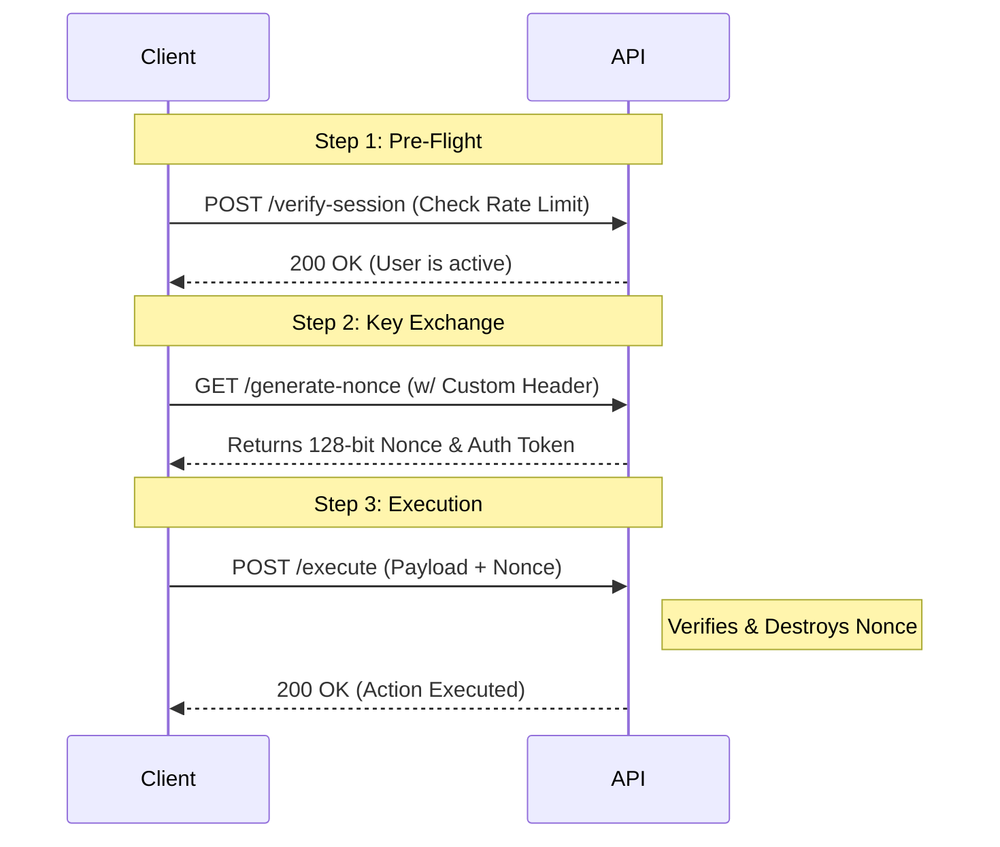

# 🛡️ Zero Trust API Guard


A language-agnostic **Zero Trust API architecture** implementing a 3-way secure handshake, active session validation, anti-spam rate limiting, and single-use cryptographic nonces.

## 🧠 The Problem & The Solution

Traditional API endpoints often rely solely on long-lived session cookies or static JWTs. If a session is hijacked or an endpoint is spammed, standard architectures struggle to mitigate the risk instantly. 

**Zero Trust API Guard** introduces a "Defense in Depth" approach:
1. **Active Session Validation:** Checks the user's active status dynamically before *every* critical request.
2. **Single-Use Nonces:** Prevents Replay Attacks and CSRF by requiring a freshly generated, 128-bit cryptographic key that is instantly burned (destroyed) upon use.
3. **Pre-flight Rate Limiting:** Blocks excessive requests at the memory level before they ever hit the database.

## 📐 Architecture (The 3-Way Handshake)



## 📂 Repository Structure

This repository provides the exact same Zero Trust architecture in three different backend environments, proving its language-agnostic nature.

```text
📦 zero-trust-api-guard
 ┣ 📂 frontend-js          # Vanilla JS Client (Async/Await Fetch API)
 ┣ 📂 backend-php          # Native PHP Session Implementation
 ┣ 📂 backend-nodejs       # Node.js & Express Implementation
 ┗ 📂 backend-python       # Python & FastAPI Implementation
```

## 🚀 Quick Start

### 1. Frontend (Vanilla JS)
The frontend uses a clean ES6 Class to handle the complex 3-way handshake under the hood. Just include `ZeroTrustApiGuard.js` and run:

```javascript
const apiGuard = new ZeroTrustApiGuard({
    preFlightUrl: 'http://localhost:3000/api/guard/verify-session',
    getNonceUrl: 'http://localhost:3000/api/guard/generate-nonce',
    executeUrl: 'http://localhost:3000/api/guard/execute',
    customAuthHeader: 'Basic ZHVtbXk6cGFzc3dvcmQ=' 
});

// Securely execute a critical action
const result = await apiGuard.makeSecureRequest({ action: 'approve_order', order_id: 1042 });
```

### 2. Backend Options
Choose your preferred backend to test the API guard:

**🟢 Node.js (Express)**
```bash
cd backend-nodejs
npm install
node server.js
# Runs on http://localhost:3000
```

**🔵 Python (FastAPI)**
```bash
cd backend-python
pip install -r requirements.txt
uvicorn main:app --reload --port 8000
# Runs on http://localhost:8000
```

**🐘 PHP (Native)**
Run this on your local server (XAMPP/MAMP, Nginx, or Apache). Update the frontend URLs to point to your PHP directory.

## 🛡️ Security Features Included
*   **Cryptographic Randomness:** Uses OS-level core randomness (`random_bytes`, `crypto.randomBytes`, `secrets.token_hex`).
*   **Race Condition Prevention:** Keys are invalidated immediately at the start of the execution phase.
*   **Memory-based Rate Limiting:** Enforces strict limits natively without relying on external services like Redis.
*   **CORS & Credential Management:** Enforces strict origin policies and secure cookie transmission.

## 📄 License
This project is licensed under the MIT License.
